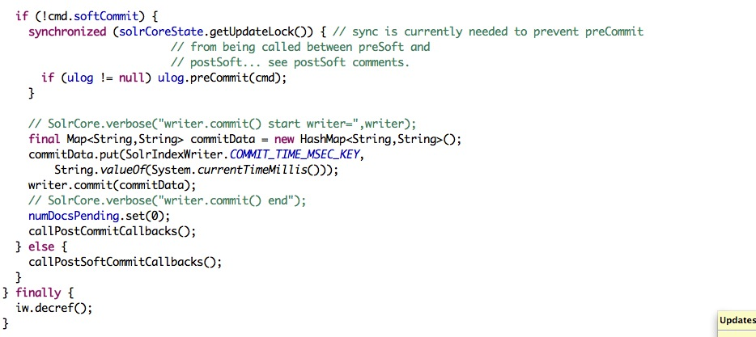

#### solr和elasticsearch
> 项目中用到了solr后来切换到了es，被问到了为什么要从solr切换到es中。（答对了一部分）。solr支持更多的功能。
支持更多的文档类型（xml，json，csv，pdf等），solr随着文档数增加，搜索效率会下降。es只支持json，但是近实
时搜索效率高，搜索效率随着文档数的增加还是能保持平稳的。但是为什么es的实时搜索效率要比solr高呢？

##### solr的索引文档和搜索操作
1. 搜索：一个文档被索引后，并不能立刻被搜索到。因为所有的搜索请求都会发送给搜索器来执行，搜索器包含了当前
luence端的快照，对于新索引的文档，还没有出现在这个快照中。要搜索到最新的文档，必须关闭当前的搜索器，重新
打开一个搜索器；但是旧的搜索器上可能还有很多正在处理的请求，要等这些请求处理完之后，才能更换到新的搜索器上。
而且重新打开搜索器，就会导致旧搜索器的缓存全部失效，还要基于最新的数据重新计算一遍索引数据，这是两个比较耗
时的操作。
为了提高搜索效率，solr允许服务器提供暂时过期的数据。在新搜索器预热完成之后，再切换到新的搜索器上。有两种
预热机制：基于旧缓存自动预热新缓存和基于预热查询。

基于预热查询：预热查询是事先配置好的一些查询语句，重新执行一遍即可。
基于旧缓存预热新缓存：根据缓冲的种类，有不同的执行策略。solr中的缓存可分为：过滤器缓存，文档缓存、查询缓存、
字段值缓存。**对应过滤器缓存和查询缓存都是重新执行一遍对应的查询语句**，这也是个耗时的操作。可以配置自动预热
的查询语句的数量。文档缓存是缓存的文档全部内容，因为查询出来的是文档id，获取文档还要访问磁盘，所以把文档缓存
起来也能提高效率。但是预热新缓存的时候，不一定要加载文档缓存，因为活跃的文档是可能发生变化的。

2. 索引文档：solr的提交分为两种：硬提交和软提交。
**硬提交**：是提交数据持久化到磁盘里面，并且能够查询到这条数据。因为它会开启一个新的searcher,但是它缺点很
明显，就是很耗性能，并会阻塞到提交任务完成，使用它是非常昂贵的操作。在提交的文档的url里使用commit=true即可
使用。

**软提交**：这种提交不会立即把数据写到磁盘，但它可以使你能立即查询到它，就是所谓的支持near real-time (NRT)
searching近实时查询，而且这样的操作不昂贵。
软提交为什么能让客户端立即搜索到呢？还是**因为软提交重新打开了一个搜索器。那么上面耗时的操作就会发生，所以导致
实时搜索效率比较差**（是不是只有这一个原因，目前还不清楚）。

[link](https://blog.csdn.net/aiyueqingfeng/article/details/51803590)

客户端发来索引请求，solr先把请求写入事务日志。然后根据硬提交的规则（多长时间，或者多少次软提交之后）
持久化到磁盘中。

##### es近实时搜索

当索引新文档的时候，es会在内存缓冲区中创建包含新文档的luence索引段，这个段虽然没有持久化，但是里面的
数据已经能够被搜索到了。通过这种方式来支持近实时搜索。
**之前所创建的过滤器缓存会自动更新，而且是增量更新的过程**。并不会根据查询语句来一次全量更新。
索引新文档时，还是先写事务日志，通过事务日志来保证数据的可靠性。
es通过每秒刷新**refresh**实现了近实时搜索。refresh后，事务日志不会清除。
要想保证可靠性，还是要把数据刷新到磁盘里，这个过程叫做flush。这是会把内存中的索引数据刷新到磁盘，并且
清空事务日志，并写入一个包含所有段列表的提交点。
分片默认每30分钟被自动刷新（flush），或者在 translog 太大的时候也会刷新

[近实时搜索](https://www.elastic.co/guide/cn/elasticsearch/guide/current/near-real-time.html)

##### es缓存

[参考这篇文章](http://baijiahao.baidu.com/s?id=1588132558463756645&wfr=spider&for=pc)

##### solr  soft hard commit
注意: 源码来自 solr 4.0.release版本,  之后就不是太清楚更改的话可能要看solr 的 Issue页面

在之前介绍的实时性框架中, Zoie 和 vsearch的实时模式是通过内存Directory的方式来实现快速Open 一个IndexReader的方式实现, Solr 中实时的模式是通过SoftCommit 的方式, 关于SoftCommit的方式, 和之前其他框架是不一样的:

   1 SoftCommit 不是通过内存索引的方式;

 2 SoftCommit 不是没有代价的, 也就是说, 他并不是很快并且没有其他性能损耗的.

有一篇文章很好的介绍了softcommit 和 hardcommit : http://searchhub.org/2013/08/23/understanding-transaction-logs-softcommit-and-commit-in-sorlcloud/

其中,  有几个重点直接Copy 过来:

Soft Commit:

Consider a soft commit. On execution you have the following:

The tlog has NOT been truncated. It will continue to grow.
The documents WILL be visible.
Some caches will have to be reloaded
Your top-level caches will be invalidated.
And again, soft commits are "less expensive" than hard commits (openSearcher=true), but they are not free.
上面的意思(我的理解,不一定靠谱...):

1  Tlog 是不会被调用FileChanle.truncate 这个api, 这个api是用来清除文件内容防止文件碎片的, 也就是说, tlog不会new一个, 并且, 内容是appand上去的, tlog记录的一行就是一条完整的CMD的命令,可以用来重播写入索引, 单节点在重启的时候会重播tlog,  所以在我们更改schema的时候, 要注意删除tlog重启(如果一些属性是reqired=true的). 也会用在solr cloud中.

2 文档新加内容可见. 注意, 之前提到过, Lucene 最根本的限制在于新加的文档需要被commit , 然后open一个新的indexreader 才可见, 这里, solr 其实使用了一个高级的lucene api完成在不commit 的情况下对磁盘索引可见. 所以文章中一再说明, softcommit 是保证可见性,但是不保证持久性, 最根本的原因,就是softcommit 不会调用lucene commit.

3 某些缓存会被reload, 但是 resultCache, documentcache, filterCache，fieldValueCache会被清空(几个cache的作用之前离离散散的有介绍过了,这里就不重复了), 因为调用了solecore的getSearcher方法.(我们的情况是documentcache不会失效)

 solr中, softcommit 只是保证可见性, 并不保证索引真实进入文件, 怎么理解这一点 ? 从源码的角度, 我觉得应该是这样:

         softCommit 不会调用lucene  commit, 原因是避免lucene commit 对实时性造成的影响, 因为既然是一种可见操作,就应该"频繁"的去做,但是对lucene 磁盘索引, 频繁的commit性能代价是很大的,

   所以solr softCommit 不会调用commit, 稍后我会把源代码附上.  那么, 没有commit, 即使调用lucene的openIfChange(oldReader):newReader的api也无法获取新的可见索引, solr 怎么做到 ？

           原因是这样的:  lucene的openIfChange(oldReader):newReader 这个api会检测 segement_N文件中的version, 这个version每一次commit都会 ++, 但是有另外一个高级的api:

           openIfChange(indexWriter):new Reader. 这个api 传入的不是原来的reader, 而是indexWriter, lucene因为一个索引只有一个indexWriter,所有的add 的文档在这个writer中是可见的, 使用这个api可以立马

          可见新添加的索引.

下面是solr DirectUpdater2 commit的源码:

上面的分支只有在!cmd.softCommit的情况下才会执行. 也就是softcommit 的情况下是不会被调用到writer.commit(commitData)这个api的. 另外, 如下图:

上面的两个lucene api 是可见性的两种方式, 第一种(soft commit 调用),  是通过传入indexWriter, 新加的文档不用commit就能可见. 第二种, hardCommit 调用,需要commit, 所以,在上面的第一张源码图中, hardcommit是要新调用 commit 然后 调用 solrCore.getSearcher ------> solrCore.newSearcher(也就是这个上面的方法), 最后都调用了 各种后台线程预热缓存(warmming) 也就是我们各种cache中的一个选项(warmming_Size).

hard Commit

 下面介绍solr hard commit, 也就是一般的commit (我直接把注释放到每一行后面):

Hard commits are about durability, soft commits are about visibility.    注释:  hanr commit 的索引持久化的, soft commit 是可见性的保证.

There are really two flavors here, openSearcher=true and openSearcher=false. First we'll talk about what happens in both cases.

If openSearcher=true or openSearcher=false, the following two consequences are most important: (客户端api默认 true, 服务端通过solrConfig 的autoCommit配置)

The tlog is truncated: A new tlog is started. Old tlogs will be deleted if there are more than 100 documents in newer tlogs.
The current index segment is closed and flushed.
Background segment merges may be initiated.
以上三点: 1 tlog我会被截断, 并且如果add > 100 会新建一个tlog   2和3 当前索引段被关闭, 新建一个索引段, 这个是lucene的特性,不属于solr
The above happens on all hard commits. That leaves the openSearcher setting

 openSearcher=true: The Solr/Lucene searchers are re-opened and  all caches are invalidated. Autowarming is done etc. This used to be the only way you could see newly-added documents.
openSearcher=false: Nothing further happens other than the three points above. To search the docs, a soft commit is necessary.
     opensearcher: 如果是true, 就会调用solrCore.getSearcher()方法打开新的reader, 一方面的影响是索引的可见性, 一方面是缓存失效和预热

     总的来讲:

                   1 soft commit 是solr 实时的模型实现(至少是4.0版本)

                   2 soft commit 不是基于内存索引

                   3  soft commit 对新加的文档可见, 不管是否commit

                   4  soft commit 是由性能损失的, 并非没有性能损失, 太频繁一样会有问题.

                   5 soft ommit 保证可见性  hard commit 保证持久性

                   6 soft commit 保持tlog 数量, 但是从不trucate tlog