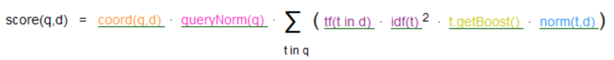

#### having
```
 Map<String, String> params = Maps.newHashMap();
        params.put("var1", "mmax");
        AggregationBuilder ab = AggregationBuilders.terms("sum").field("applyId").size(1000)
                .subAggregation(AggregationBuilders.max("mmax").field("updated"))
                .subAggregation(PipelineAggregatorBuilders.bucketSelector("bucket_selector", params, new Script("var1 >= 1531282265", ScriptService.ScriptType.INLINE, "expression", params)));

```

```
Map<String, String> params = Maps.newHashMap();
params.put("var1", "mmax");
AggregationBuilder ab = AggregationBuilders.terms("sum").field("applyId").size(1000)
        .subAggregation(AggregationBuilders.max("mmax").field("updated"))
        .subAggregation(PipelineAggregatorBuilders.bucketSelector("bucket_selector", params, new Script("params.var1 >= 1531282265")));
```


```
Map<String, String> params = Maps.newHashMap();
params.put("var1", "mmax");
AggregationBuilder ab = AggregationBuilders.terms("sum").field("applyId").size(1000)
        .subAggregation(AggregationBuilders.max("mmax").field("updated"))
        .subAggregation(PipelineAggregatorBuilders.bucketSelector("bucket_selector", new Script("params._value0 >= 1531282265"), "mmax"));
```

#### es打分模型

Lucene采用布尔模型（Boolean model）、词频/逆向文档频率（TF/IDF）、以及向量空间模型（Vector Space Model），然后将他们合并到单个包中来收集匹配文档和分数计算。


[](https://blog.csdn.net/sd4015700/article/details/50427568)
打分计算公式： 
```
score(q,d)  =  queryNorm(q) * coord(q,d)    
          * ∑ (           
                tf(t in d)  
              · idf(t)²      
              · t.getBoost() 
              · norm(t,d)   
            ) (t in q) 
```



公式中的字符的含义：q：查询项  d文档  t短语

- coord(q,d) 评分因子，基于文档中出现查询项的个数。越多的查询项在一个文档中，说明文档的匹配程度越高。比如命中了比较多的should查询
- queryNorm(q) 查询正则因子（queryNorm）试图将查询正则化，这样就能比较两个不同查询结果。尽管查询正则值的目的是为了使查询结果之间能够相互比较，
 但是它并不十分有效，因为相关度分数_score的目的是为了将当前查询的结果进行排序，比较不同查询结果的相关度分数没有太大意义。
 **这个因素对所有文档都是一样的值，所以它不影响排序结果。**
- norm(t,d) （Field-length norm） 长度相关的加权因子


- 词频（Term frequency）TF  当前term出现的概率

  tf(t in d) = √(numTerm / all num)
  是一词语出现的次数除以该字段的总词语数的值得平方根。但是一些词比如 the '是' '这'等助词的概率会比较高。所以需要另一个概率来把这种词的权重降低：IDF。

- 逆向文档频率（Inverse document frequency）  
  IDF是一个词语普遍重要性的度量，可以由总文件数目除以包含该词语之文件的数目，再将得到的商取以10为底的对数得到，简单表示下就是
  idf=log(包含改词的文档数/总文档数)  
  词语在出现的文档越多，这个值越大。但是这个值出现再分母上，意味着权重越低。
  这里有个问题就是：**总文档数是当前分片上的文档数，不是所有分片上的文档数**
                   
- Field-length norm（字段长度相关度）
  当一个单词出现在一个短字段中（文档是由多个字段组成的，查询的时候，针对某个字段或者某几个字段进行查询），要比出现在一个长字段中占得比重高。
  norm(d) = 1 / √numTerms 
  numTerms是一个字段里面的term数量。
  开启这个功能每个文档要占用1个字节的内存。所以不需要的话，可以关闭。对于非分词的string默认就是不开启的。

- t.getBoost  Query-Time Boosting 查询时项t的加权
  任意一种类型的查询都能接受权重提升（boost）参数。将权重提升值设置为2，并不代表最终的分数会是原值的2倍；权重提升值会经过正则化和一些其他内部优化过程。
尽管如此，它确实想要表明一个提升值为2的句子的重要性是提升值为1句子的2倍。

- function_score 查询（function_score Query）
  允许用户为查询到的文档修改评分的功能，系统预定义了以下函数，用来方便的修改从es查询出的原始评分。
  weight
  为每个文档应用一个简单的而不被正则化的权重提升值：当 weight 为 2 时，最终结果为 2 * _score
  field_value_factor
  使用这个值来修改 _score，如将流行度或评分作为考虑因素。
  random_score
  为每个用户都使用一个不同的随机分数来对结果排序，但对某一具体用户来说，看到的顺序始终是一致的。
  Decay functions — linear, exp, gauss
  以某个字段的值为标准，距离某个值越近得分越高。
  script_score
  如果需求超出以上范围时，用自定义脚本完全控制分数计算的逻辑。
  它还有一个属性boost_mode可以指定计算后的分数与原始的_score如何合并，有以下选项：
  multiply
  将分数与函数值相乘（默认）
  sum
  将分数与函数值相加
  min
  分数与函数值的较小值
  max
  分数与函数值的较大值
  replace
  函数值替代分数
  
  
- field_value_factor
  field_value_factor的目的是通过文档中某个字段的值通过指定的公式结合原始的评分重新计算出一个分数。